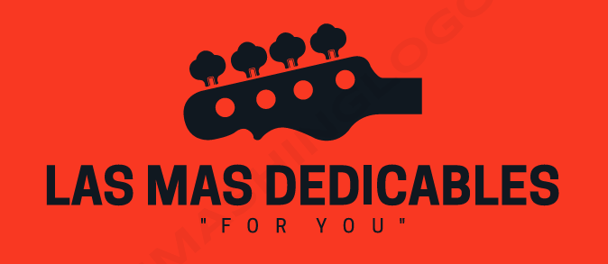

# Creando una Red Social

## Índice

* [1.LAS MAS DEDICABLES](#1-LAS-MAS-DEDICABLES)
* [2. Resumen del proyecto](#2-resumen-del-proyecto)
* [3. prototipos](#3-prototipos)
* [4. agradecimiento](#4-agradecimiento)

## 1. LAS MAS DEDICABLES

Instagram, Snapchat, Twitter, Facebook, Twitch, Linkedin, etc. Las redes
sociales han invadido nuestras vidas. Las amamos u odiamos, y muchos no podemos
vivir sin ellas.

Hay redes sociales de todo tipo y para todo tipo de intereses. En esta ocasión quise desarrollar LAS MAS DEDICABLES, una red social donde  todos pueden dejar sus dedicatorias de canciones , y compartir un poco de la musica que mueve sus corazones.

## 2. Resumen del proyecto

En este proyecto el Usuario puede registrarse y loguearse directamente con su cuenta de google.
tambien puede publicar su post y eliminarlo si lo desea.

## 3. prototipos

El prototipo es una parte muy importante de un proyecto ya que con el puedes plasmar tu idea principal e irte guiando para lograr tu objetivo, en mi caso siempre trato de apegarme lo mas posible a el. en cuanto a funcionalidades y el lado visual.

## 4. agradecimiento
Como final comentario debo reconocer que fue dificil, sin embargo lleno de aprendizaje y nuevos retos. gracias a las personas que estuvieron guiandome en este proyecto.